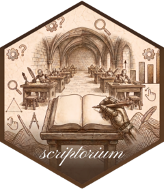

<!-- README.md is generated from README.Rmd. Please edit that file -->

# scriptorium 

<!-- badges: start -->

[](https://lifecycle.r-lib.org/articles/stages.html#experimental)
<!-- badges: end -->

**scriptorium** installs and loads the *vellum* graphics ecosystem in
one step, the way [tidyverse](https://www.tidyverse.org) does for data
science. The name is the medieval *scriptorium*, the room where
manuscripts were written and copied. Its packages carry the same
metaphor:

| package | role | analogy |
|----|----|----|
| [**vellum**](https://github.com/schochastics/vellum) | low-level graphics backend, a Rust scene graph, unit/layout engine, and PNG/SVG/PDF renderer | `grid` |
| [**quill**](https://github.com/schochastics/quill) | pipe-first grammar of graphics that compiles a plot spec into a vellum scene | `ggplot2` |
| [**gloss**](https://github.com/schochastics/gloss) | client-side interactive HTML widgets for the scenes they produce | `plotly`/`htmlwidgets` |

`vellum` is the parchment, `quill` is the pen, and `gloss` is the
annotation revealed on the page.

## Installation

The ecosystem compiles a Rust crate (in `vellum`), so you need a Rust
toolchain (`cargo`/`rustc`) alongside R. Then:

``` r
# install.packages("pak")
pak::pak("schochastics/scriptorium")
```

## Usage

``` r
library(scriptorium)
#> ── Attaching packages ─────────────────────────────── scriptorium 0.0.0.9000 ──
#> ✔ vellum 0.0.0.9001   ✔ quill 0.0.0.9000   ✔ gloss 0.0.0.9000
```

That single call attaches all three core packages, so you can go from a
data frame to an interactive plot in one pipeline:

``` r
library(scriptorium)

df <- data.frame(wt = mtcars$wt, mpg = mtcars$mpg, model = rownames(mtcars))

vplot(df) |>                                     # quill: grammar of graphics
  mark_point(x = wt, y = mpg, color = mpg,
             tooltip = model, data_id = model) |>
  scale_color_continuous() |>
  as_widget()                                    # gloss: interactive widget
```

`vplot()`, `mark_point()`, and the scales come from **quill**;
`as_widget()` comes from **gloss**; both compile down to a **vellum**
scene.

## Helpers

``` r
scriptorium_packages()    # the packages scriptorium bundles
scriptorium_conflicts()   # functions masked across the ecosystem
```

To load the packages without the startup banner, set
`options(scriptorium.quiet = TRUE)` before attaching.
