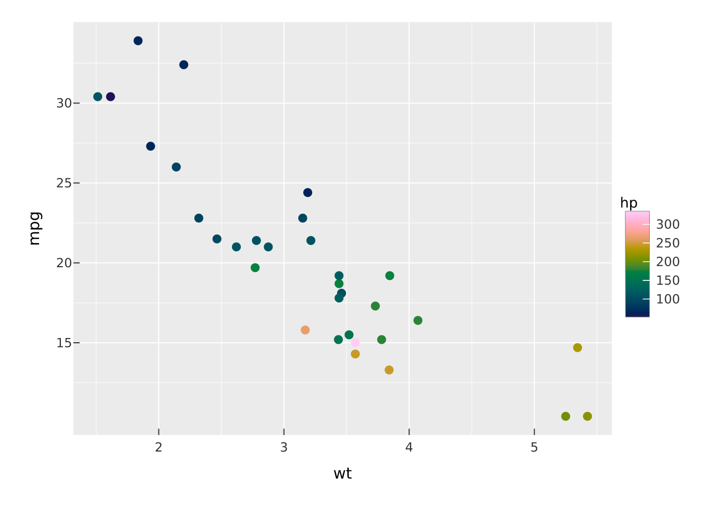
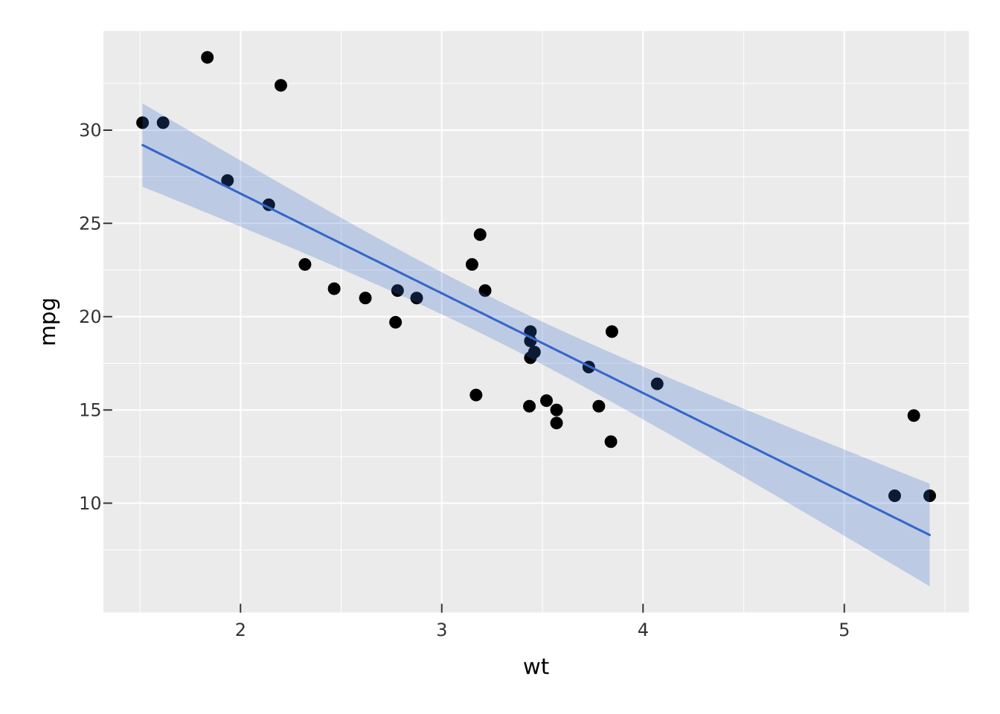
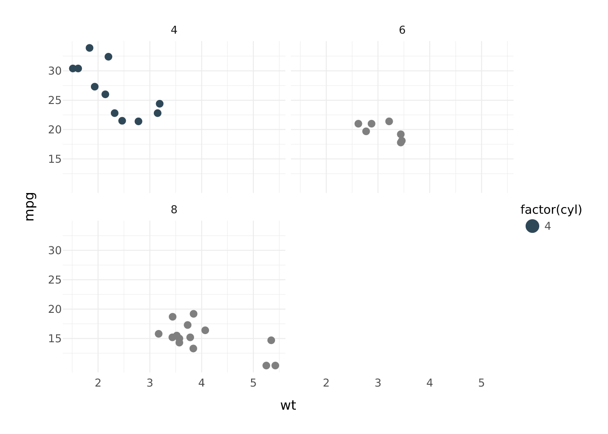

# Coming from ggplot2

If you already think in `ggplot2`, `vellumplot` will feel familiar: data
in, aesthetics mapped to marks, scales and facets and themes layered on
top. The grammar is the same idea. Four things are different, and once
they click the rest is a matter of renaming.

Throughout, the `ggplot2` code is shown for reference and the
`vellumplot` equivalent is the one rendered.

## The four differences

**1. `|>`, not `+`.** Layers are joined with the base pipe. A
`vellumplot` plot is an ordinary pipeline, so the first argument of
every verb is the plot.

**2. No `aes()`.** Aesthetics are named arguments on the mark itself. A
bare column name is mapped to data; a literal value is a constant.
`color = hp` is a channel with a legend; `color = "red"` paints
everything red.

**3. `geom_*` becomes `mark_*`.** Same layers, different prefix.
`geom_point()` is `mark_point()`, `geom_smooth()` is `mark_smooth()`,
and so on.

**4. A plot is a spec, not a picture.** `vellumplot` builds an
inspectable specification and compiles it only when printed, saved, or
made interactive. [`summary()`](https://rdrr.io/r/base/summary.html)
shows you the spec without drawing it.

## Translation table

| ggplot2                          | vellumplot                              |
|----------------------------------|-----------------------------------------|
| `ggplot(df, aes(x, y))`          | `vplot(df)` then `mark_*(x = x, y = y)` |
| `aes(color = z)`                 | `color = z` on the mark                 |
| `+`                              | `\|>`                                   |
| `geom_point()`                   | `mark_point()`                          |
| `geom_line()` / `geom_path()`    | `mark_line()`                           |
| `geom_col()` / `geom_bar()`      | `mark_bar()`                            |
| `geom_smooth()`                  | `mark_smooth()`                         |
| `geom_histogram()`               | `mark_histogram()`                      |
| `geom_boxplot()`                 | `mark_boxplot()`                        |
| `geom_tile()` / `geom_raster()`  | `mark_tile()` / `mark_raster()`         |
| `geom_hex()`                     | `mark_hex()`                            |
| `geom_sf()`                      | `mark_sf()`                             |
| `scale_color_continuous()`       | `scale_color_continuous()`              |
| `scale_*_manual(values = )`      | `scale_*_manual(values = )`             |
| `facet_wrap(~z)`                 | `facet_wrap(~z)`                        |
| `facet_grid(a ~ b)`              | `facet_grid(a ~ b)`                     |
| `coord_flip()` / `coord_polar()` | `coord_flip()` / `coord_polar()`        |
| `theme_minimal()`                | `theme_minimal()`                       |
| `labs(title = )`                 | `labs(title = )`                        |
| `ggsave("p.png")`                | `render_plot(p, "p.png")`               |

Note that spelling: `vellumplot` uses American `color` as the primary
aesthetic name (with `colour`/`fill` accepted where it makes sense).

## Scatter with a colour scale

``` r

# ggplot2
ggplot(mtcars, aes(wt, mpg, color = hp)) +
  geom_point() +
  scale_color_continuous()
```

``` r

# vellumplot
vplot(mtcars) |>
  mark_point(x = wt, y = mpg, color = hp) |>
  scale_color_continuous()
```



## Points with a fitted line

The layering translates one-to-one; the `+` becomes a `|>` and each geom
becomes a mark. Note that `vellumplot` marks carry their own encodings
rather than inheriting a top-level `aes()`.

``` r

# ggplot2
ggplot(mtcars, aes(wt, mpg)) +
  geom_point() +
  geom_smooth(method = "lm")
```

``` r

# vellumplot
vplot(mtcars) |>
  mark_point(x = wt, y = mpg) |>
  mark_smooth(x = wt, y = mpg, method = "lm")
```



## Faceting

`facet_wrap()` and `facet_grid()` keep their names and their formula
interface.

``` r

# ggplot2
ggplot(mtcars, aes(wt, mpg, color = factor(cyl))) +
  geom_point() +
  facet_wrap(~cyl) +
  theme_minimal()
```

``` r

# vellumplot
vplot(mtcars) |>
  mark_point(x = wt, y = mpg, color = factor(cyl)) |>
  facet_wrap(~cyl) |>
  theme_minimal()
```



## A bar chart with a manual palette

``` r

# ggplot2
ggplot(mpg, aes(class, fill = class)) +
  geom_bar() +
  scale_fill_manual(values = c("#6b4f2c", "#8a7350")) +
  coord_flip()
```

``` r

# vellumplot
vplot(mpg) |>
  mark_bar(x = class, fill = class) |>
  scale_fill_manual(values = c("#6b4f2c", "#8a7350")) |>
  coord_flip()
```

## What you gain

Two things `ggplot2` cannot easily do fall out of the spec-first design.

**Inspect a plot before drawing it.** Because the plot is data,
[`summary()`](https://rdrr.io/r/base/summary.html) prints its structure:

``` r

vplot(mtcars) |>
  mark_point(x = wt, y = mpg, color = hp) |>
  summary()
#> <PlotSpec> 32x11 (11 columns), page 6x4 in
#>
#> ── layers
#> • mark_point(x = wt, y = mpg, color = hp)
```

**Make it interactive for free.** The same spec, handed to
`as_widget()`, becomes an HTML widget. The interactive channels
(`tooltip`, `data_id`) are more mark arguments:

``` r

df <- data.frame(wt = mtcars$wt, mpg = mtcars$mpg, model = rownames(mtcars))

vplot(df) |>
  mark_point(x = wt, y = mpg, tooltip = model, data_id = model) |>
  as_widget()
```

## What is different by design

A few `ggplot2` habits do not carry over, on purpose:

- There is no global `aes()` shared across layers; each mark states its
  own encodings. This is more verbose for multi-layer plots but removes
  the inheritance rules you have to keep in your head.
- `+` chaining and its operator methods are gone; everything is a
  function in a pipe.
- Saving is `render_plot()`, not `ggsave()`, and one spec renders to
  PNG, SVG, and PDF from the same object. See [one scene, three
  outputs](https://r-vellum.github.io/vellumverse/articles/one-scene-three-outputs.md).

For the exhaustive list of marks, scales, coords, and themes, see the
[vellumplot reference](https://r-vellum.github.io/vellumplot/).
