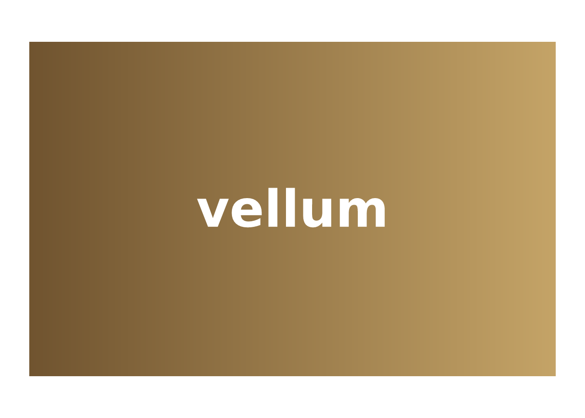

# The vellum ecosystem

`vellumverse` is a meta-package: it holds no plotting code of its own.
Its job is to install and attach the three packages that make up the
*vellum* graphics ecosystem, so that

``` r

library(vellumverse)
#> ── Attaching packages ───────────────────────────────────── vellumverse 0.2.0
#> ──
#> ✔ vellum 0.2.0.9000 ✔ vellumplot 0.3.0.9000
#> ✔ vellumwidget 0.3.0.9000
#> ── Conflicts ──────────────────────────────────────── vellumverse_conflicts() ──
#> ✖ vellumplot::linear_gradient masks vellum
#> ✖ vellumplot::md              masks vellum
#> ✖ vellumplot::radial_gradient masks vellum
#> ✖ vellumplot::sketch          masks vellum
```

puts all of them on your search path at once. Each one owns a distinct
layer of the stack, and the design intent is that you rarely think about
the boundaries between them.

## Three layers, one scene

The parchment, the pen, and the annotation each have a name:

| layer | package | what it is | the tidyverse analogue |
|----|----|----|----|
| backend | **vellum** | a retained scene graph, unit/layout engine, and PNG/SVG/PDF renderer, with a Rust engine | `grid` |
| grammar | **vellumplot** | a pipe-first grammar of graphics that *compiles* a plot spec into a vellum scene | `ggplot2` |
| interaction | **vellumwidget** | turns a vellum scene into a self-contained interactive HTML widget | `htmlwidgets` |

The important word is **compiles**. A `vellumplot` plot is not drawn as
you build it; it is an inspectable specification that is turned into a
`vellum` scene only when it is printed, rendered, or handed to
`vellumwidget`. Everything below is therefore one scene passing down the
stack.

## vellum: the parchment

`vellum` is the foundation. You describe a scene with a small
declarative API and render it; the scene graph, layout, and drawing run
in Rust, and the same scene renders to raster or vector.

``` r

vl_scene(width = 4, height = 2.4, bg = "white") |>
  draw(rect_grob(
    width = 0.9, height = 0.8,
    gp = vl_gpar(fill = linear_gradient(c("#6b4f2c", "#c9a86a")), col = NA)
  )) |>
  draw(text_grob(
    "vellum", x = 0.5, y = 0.5,
    gp = vl_gpar(fontsize = 44, col = "white", fontface = "bold")
  ))
```



You would reach for `vellum` directly to build a bespoke visual, or as
the target of a higher-level tool, which is exactly what `vellumplot`
is.

## vellumplot: the pen

`vellumplot` gives you the grammar: data in, marks and scales declared
with tidy evaluation, everything trained and laid out for you.

``` r

vplot(mtcars) |>
  mark_point(x = wt, y = mpg, color = hp) |>
  scale_color_continuous()
```


Because the plot is a spec, you can inspect it without drawing anything:

``` r

summary(vplot(mtcars) |> mark_point(x = wt, y = mpg, color = hp))
#> <PlotSpec> 32x11 (11 columns), page 6x4 in
#>
#> ── layers
#> • mark_point(x = wt, y = mpg, color = hp)
```

## vellumwidget: the annotation

`vellumwidget` is terminal: hand it a `vellumplot` plot (or a bare
`vellum` scene) and it compiles the scene, emits the SVG plus a
per-element table, and returns an htmlwidget with hover tooltips,
selection, brushing, and pan/zoom, with no Shiny and no server.

``` r

df <- data.frame(wt = mtcars$wt, mpg = mtcars$mpg, model = rownames(mtcars))

vplot(df) |>
  mark_point(x = wt, y = mpg, tooltip = model, data_id = model) |>
  as_widget()
```

The `tooltip` and `data_id` arguments are declared in `vellumplot`, read
by `vellumwidget`, and carried through the `vellum` scene: the three
layers agreeing on one contract.

## Where each package’s docs live

`vellumverse` is the front door; each package documents itself in full:

- [vellum](https://r-vellum.github.io/vellum/): grobs, units, viewports,
  the paint model,
  [`datashade()`](https://r-vellum.github.io/vellum/reference/datashade.html),
  and grid interop.
- [vellumplot](https://r-vellum.github.io/vellumplot/): the full mark,
  scale, facet, coord, and theme reference.
- [vellumwidget](https://r-vellum.github.io/vellumwidget/): interaction
  options, linked views, and crosstalk interop.
